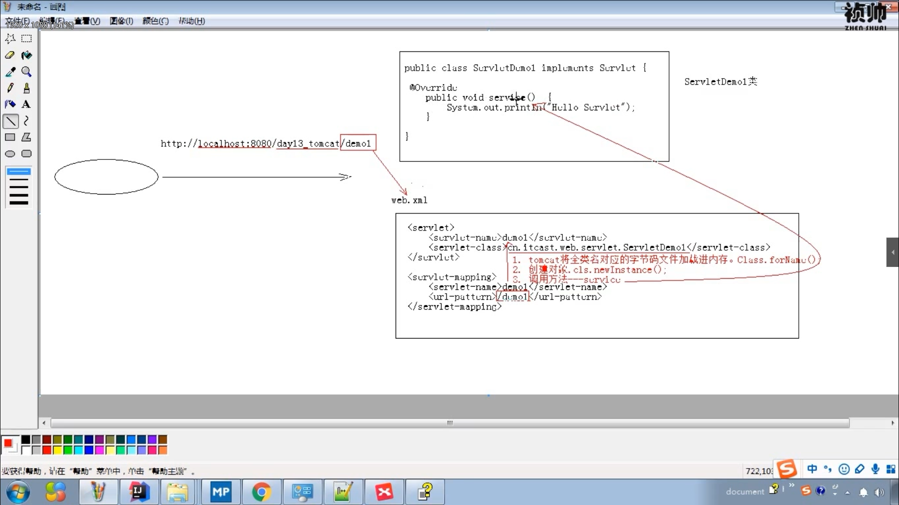

# Servlet

整个Java Web的核心都是围绕Servlet来转的


* 概念：Servlet applet
  * 概念：运行在服务端的小程序
    * Servlet就是一个接口，定义了Java类被浏览器访问到（Tomcat识别）的规则
    * 将来我们自定义一个类，实现Servlet接口，复写方法

  * 快速入门：
    * 创建JavaEE项目
    * 定义一个类，实现Servlet接口
    * 实现接口中的抽象方法
    * 配置Servlet

```
<?xml version="1.0" encoding="UTF-8"?>
<web-app xmlns="http://xmlns.jcp.org/xml/ns/javaee"
         xmlns:xsi="http://www.w3.org/2001/XMLSchema-instance"
         xsi:schemaLocation="http://xmlns.jcp.org/xml/ns/javaee http://xmlns.jcp.org/xml/ns/javaee/web-app_3_1.xsd"
         version="3.1">
    <!-- 配置Servlet -->
    <servlet>
        <servlet-name>demo1</servlet-name>
        <servlet-class>cn.root0439.servlet.DemoServlet01</servlet-class>
    </servlet>
    <servlet-mapping>
        <servlet-name>demo1</servlet-name>
        <url-pattern>/demo1</url-pattern>
    </servlet-mapping>
</web-app>
```

  * 执行原理：
    * 当服务器接收到客户端浏览器的请求后，会解析请求URL路径，获取访问的servlet的资源路径
    * 查找web.xml文件，是否有对应的<url-pattern>标签体内容
    * 如果有则会找到<servlet-class>的全类名
    * tomcat会将字节码加载进内存，并且创建起对象
    * 调用其方法



## Servlet中的方法--生命周期

1. 被创建：执行init方法，只执行一次
   * servlet什么时候被创建:
     * 默认情况：第一次被访问时，Servlet被创建
     * 可以配置执行servlet的创建时机。
       * 在web.xml-->的servlet中
       * 在第一次被访问时创建
         * <load-on-startup>值为负数</load-on-startup>
       * 在服务器启动时，创建
         * <load-on-startup>值为0，或者正整数</load-on-startup>
  * Servlet的init方法，只执行一次，说明一个servlet在内存中只存在一个对象,`Servlet`是`单例`的
    * 多个用户访问时，会存在安全问题
    * 解决：`尽量不要在serlvet中定义成员变量。即使定义了成员变量也不要对其修改值`
2. 提供服务：执行service方法，执行多次
3. servlet关闭时：执行destroy方法，执行一次
  * 只有服务器`正常关闭时`，才会执行destroy方法
```
/**
     * 初始化方法
     * 在servlet被创建时，执行，只会执行一次
     * @param servletConfig
     * @throws ServletException
     */
    @Override
    public void init(ServletConfig servletConfig) throws ServletException {
        System.out.println("init...");
    }


    /**
     * 提供服务方法
     * 每一次servlet被访问时，执行，执行多次
     * @param servletRequest
     * @param servletResponse
     * @throws ServletException
     * @throws IOException
     */
    @Override
    public void service(ServletRequest servletRequest, ServletResponse servletResponse) throws ServletException, IOException {
        System.out.println("service...");
    }


    /**
     * 销毁方法
     * 在服务器正常关闭时，执行，执行一次
     *
     */
    @Override
    public void destroy() {
        System.out.println("destory...");
    }
```

## Servlet注解配置

* 好处：
  * 支持注解配置，可以不需要使用web.xml了

* 步骤：
  * 创建JavaEE项目，选择Servlet版本`在3.0以上`
  * 定义一个类，实现Servlet接口
  * 复写方法
  * 在类上使用@WebServlet注解

```
@WebServlet(urlPatterns = "/demo")

@WebServlet("/demo")

因为value表示最重要的属性：URLPattern，且当其只有一个值的时，value=可以省略
```

```
public @interface WebServlet {
    String name() default "";

    String[] value() default {};

    String[] urlPatterns() default {};

    int loadOnStartup() default -1;

    WebInitParam[] initParams() default {};

    boolean asyncSupported() default false;

    String smallIcon() default "";

    String largeIcon() default "";

    String description() default "";

    String displayName() default "";
}
```

## IDEA与Tomcat配置

1. IDEA会为每一个Tomcat部署的项目单独建立一份配置文件
   * 查看控制台的log输出：有一个catalina_base
2. 一个项目有两个空间存储 工作空间  和  tomcat部署的web项目
  * tomcat真正访问的是后者，tomcat部署的web项目对应着工作空间项目的web目录下的所有资源
  * web-inf中的内容是不能被浏览器访问到

## Servlet 体系结构

* Servlet 接口
* GenericServlet --抽象类
  * 除了service以外都进行了空实现
* HTTPServlet -- 抽象类
  * 对http协议的一种封装，简化操作
  * 操作步骤
    * 定义类继承HttpServlet
    * 重写doGet，doPost方法


Servlet
  * service
    1. 判断请求方式

    2. String method = req.getMethod();

    3. if("GET".equals(method))

    4. else if("POST".equals(method))

## Servlet相关配置

* urlPatterns
  * 一个Servlet可以定义多个访问路径 @WebServlet({"/d4","/dd4",...})
  * 路径定义规则
    * /***
    * /\*\*\*/\*\*\*
    * xxx.do