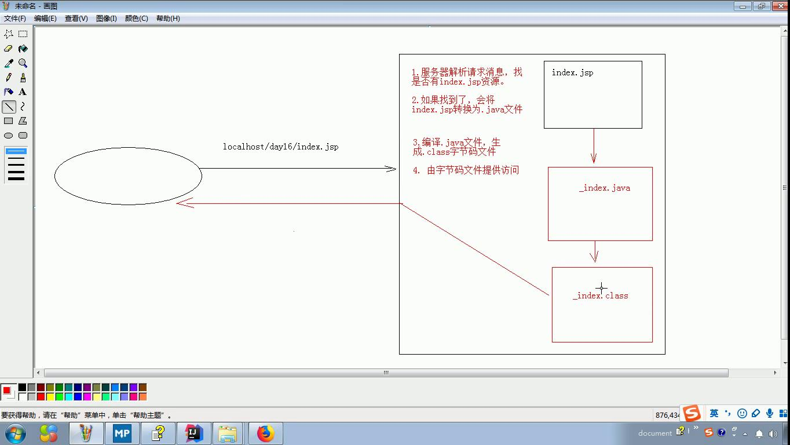

# 会话

* 会话技术
  * 一次会话中包含多次请求和响应
    * 一次会话：浏览器第一次给访问服务器发送请求，会话建立直到有一方断开为止
1. 功能：
      * 共享数据
        * 在一次会话中共享数据
2. 方式：
   1. 客户端会话技术：cookie
   2. 服务器端会话技术：session

## Cookie（客户端会话技术）：

* Cookie：
  * 概念：客户端会话技术，将数据保存在客户端
  * 快速入门：
    * 使用步骤：
      1. 创建Cookie对象，绑定数据
         * new Cookie(String name,String value); 
      2. 发送Cookie对象
         * resp.addCookie(Cookie cookie); 
      3. 获取Cookie，拿到数据 
         * Cookie[] request.getCookies(); 
    * Cookie是和客户端浏览器绑定的，比如说都在Chrome浏览器

客户端                          服务端

                -请求->
保存cookie       <-响应-     CookieDemo01 发送cookie
随着请求发送c     -请求->     CookieDemo02 获取cookie
                <-响应-

  * cookie的细节
    1. 一次可以发送多个cookie么？
       1. 可以，多次new，多次add就可以了
    2. cookie在浏览器中保存多长时间？
       1. 默认情况下，当浏览器关闭后，Cookie数据被销毁
       2. 持久化存储：
          1. setMaxAge(int seconds)
             1. 正数：将Cookie数据写到硬盘的文件中。seconds存活时间
             2. 负数：默认值
             3. 0：删除cookie
    3. cookie能不能存中文？
       1. 在tomcat8之前不可以存中文数据
       2. 在tomcat8之后可以存中文数据
    4. cookie共享问题？ 
       1. 假设在一个tomcat服务器中，部署了多个web项目，那么在这些web项目之间能否共享？
          1. 默认情况下cookie不能共享
          2. cookie.setPath(String path); cookie的可获取范围。默认情况下，设置当前的虚拟目录
       2. 不同的tomcat服务器之间cookie共享问题：
          * setDomain(String path);如果设置一级域名相同，那么多个服务器之间cookie就可以共享
             * setDomain(".baidu.com"),那么tieba.baidu.com和news.baidu.com中cookie可以共享 
  * cookie特点：
    1. cookie存储数据在客户端浏览器
    2. 浏览器对于单个cookie的大小有限制(4kb)，以及对同一个域名下的总cookie数量也有限制(20个)
    * 作用：
      1. cookie一般用于存出少量的不太敏感的数据
      2. 用于离线时的身份识别

## JSP：入门学习
1. 概念：
   1. Java Server Pages
   2. 一个特殊的一面，其中既可以指定html页面，也可以写Java代码
   3. 可以简化书写
2. 原理
   1. 服务器解析请求消息找是否有index.jsp文件
   2. 如果找到了，将其转换为.java文件
   3. 编译.java文件，生成.class字节码文件
   4. 由字节码文件提供访问

3. JSP脚本：JSP定义Java代码的方式
   1. <% 代码 %>：定义的java代码，在service方法中。可以定义Servlet方法中可以定义什么，该脚本就可以定义什么
   2. <%! 代码 %>：定义的java代码，在jsp转换后的java类的成员位置。成员可以定义什么就可以定义什么
   3. <%= 代码 %>：定义的java代码，会输出到页面上。输出语句中可以定义什么，它就可以定义什么。

4. JSP内置对象
   * 在JSP中不需要定义就可以直接使用的对象
   * JSP一共有9个内置对象：
     1. request
     2. response
     3. out：字符输出流对象。可以将数据输出到页面上。和response.getWriter()类似
        * 二者又是有差别的
          1. 无论二者定义的先后顺序如何，response.getWriter()总是会先于out.print()输出 

## Session：

1. 概念：服务器端会话技术，再一次会话的多次请求间共享数据，将数据保存在服务器端的对象中。HttpSession
2. 快速入门：
   1. HttpSession对象：
      1. Object getAttribute(String name);
      2. void setAttribute(String name,String value);
      3. void removeAttribute(String name);

3. 原理
服务器如何确保在一次会话范围内，多次获取的Session对象时同一个？?

4. 细节：
   1. 当客户端关闭后，服务器不关闭，两次获取session是否为同一个
      1. 默认情况下，不是。
      2. 如果需要相同，则可以创建cookie，键为JSESSIONID,设置最大存活时间，让cookie持久化保存
   2. 客户端不关闭，服务器关闭后，两次获取的session是否为同一个
      1. 不一样，但是要确保数据不丢失
         1. session的钝化：
            1. 在服务器正常关闭之前，将session对象系列化到硬盘上
         2. session的活化
            1. 在服务器启动后，将session文件转化为内存中的session对象
      2. work目录存放tomcat运行过程中动态生成的文件
         1. tomcat会自动完成钝化和活化的过程，在关闭时生成，在重新开启时加载进来并删除session文件
         2. idea也可以进行钝化，但重新启动后会再次创建work目录，删除原来的，所以活化不了了，不过编程完毕会运行本地Tomcat，就不会存在这个问题
   3. session失效时间
      1. 服务器关闭时
      2. session对下那个调用invalidate();
      3. session默认失效时间：30分钟

5. session特点：
   1. session用于存出一次会话的多次请求的数据，存在服务器端
   2. session可以存出任意类型，任意大小限制

   * session与cookie的区别：
     * session存储数据在服务器端，cookie存在客户端
     * session没有数据大小限制，cookie有
     * session数据安全，cookie相对不安全